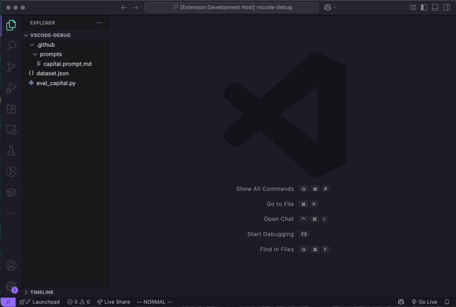

# Copilot Chat Prompt Evaluator

A VSCode extension for evaluating GitHub Copilot Chat prompts against test datasets.




This repository accompanies the blog post [Building an Evaluation Harness for VSCode Copilot Chat]() and provides a proof-of-concept implementation that developers can use and extend. While not currently published to the marketplace, if it proves useful and stable it may be published in the future.

## Why?

When building custom prompts for VSCode Copilot Chat, you need systematic testing to:
- Measure performance across different inputs
- Catch regressions when modifying prompts
- Make data-driven improvements

Without evaluation, you're stuck with "it seems to work fine" - and changing prompts becomes a game of whack-a-mole.

## How it works

This extension automates VSCode's chat interface to:
1. Load your prompt file (`*.prompt.md`)
2. Run it against each test case in your dataset
3. Export results for analysis

## Installation

1. Clone this repository
2. Run `npm install`
3. Run `npm run compile`
4. Open the project in VSCode
5. Press F5 (or Debug > Start Debugging) on `extension.ts` to launch a new VSCode window with the extension loaded

## Quick Start

1. In the extension development host window, create a prompt file (e.g., `capital.prompt.md`):
   ```markdown
   ---
   mode: agent
   tools: []
   ---
   The user provides a country and you should answer with only the capital of that country.
   ```

2. Create a test dataset (`dataset.json`):
   ```json
   [
       {"input": "France", "waitMs": 4000, "capital": "Paris"},
       {"input": "Japan", "waitMs": 4000, "capital": "Tokyo"},
       {"input": "Spain", "waitMs": 4000, "capital": "Madrid"}
   ]
   ```

3. Open the prompt file and run: **"Evaluate Active Prompt"** (Cmd/Ctrl+Shift+P)
4. Select your dataset file
5. Press Enter when the save dialog appears (for each test case)
6. Find results in `.github/evals/<prompt>/<timestamp>.json`

## Limitations

- **Sequential only** - No parallel execution
- **Fixed wait times** - Must guess completion time
- **Manual saves** - Press Enter for each export
- **Read-only prompts** - No file modifications or API calls
- **Single-turn only** - One input, one output

## Example Evaluation

```python
import json
import sys
from pathlib import Path

dataset = json.loads(Path(sys.argv[1]).read_text())
results = json.loads(Path(sys.argv[2]).read_text())

correct = 0
for record, result_chat in zip(dataset, results):
    answer = result_chat["requests"][0]["response"][0]["value"]
    correct += 1 * (record["capital"] in answer)

accuracy = correct / len(dataset) * 100
print(f"Accuracy: {accuracy:.2f}% ({correct}/{len(dataset)})")
```

## When to Use

Perfect for early experimentation with prompt ideas. Despite limitations, having imperfect evaluation beats having none - you get concrete signals about what works instead of guessing.
